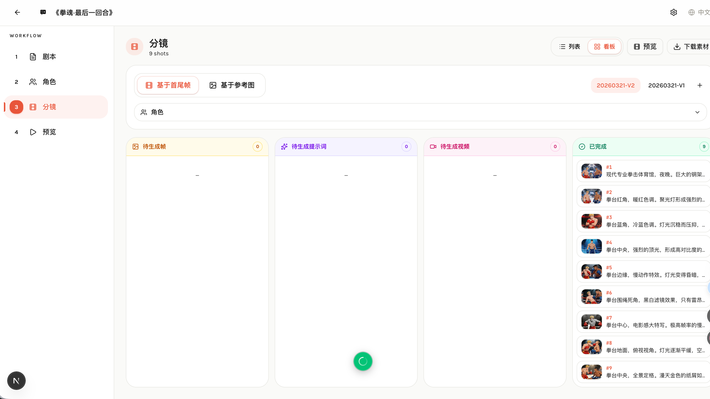
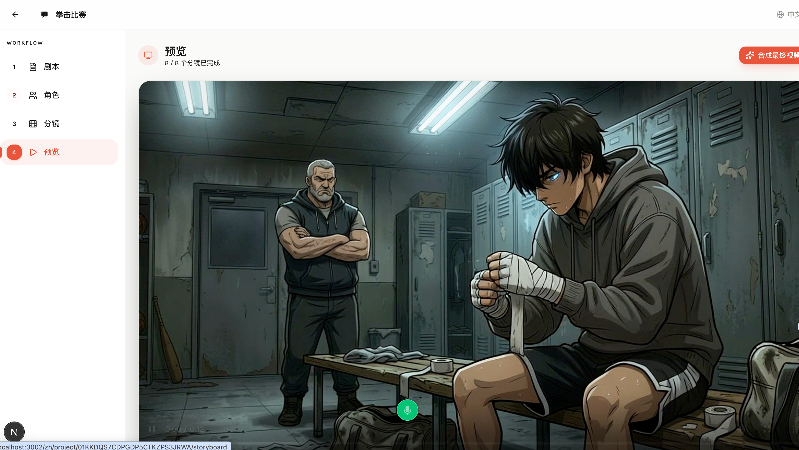

# 开源了！一个人用 AI 把剧本变成动画短片 — AI Comic Builder

> 从一段文字到一部完整动画，全程 AI 驱动，你只需要写（或让 AI 写）一个剧本。

---

## 先看成品

在介绍工具之前，先看两段完全由 AI Comic Builder 生成的动画短片：

[《拳魂·最后一回合》- Seedance 2.0 生成](https://www.bilibili.com/video/BV1fVAuzLEAX/)

[《拳魂·最后一回合》- Seedance 1.5 生成](https://www.bilibili.com/video/BV1WGAPzrEs1/)

没有手绘，没有建模，没有 After Effects。**从剧本到成片，一个人，一个工具，全部搞定。**

---

## 这是什么？

**AI Comic Builder** 是一个开源的 AI 漫剧生成器。它把"剧本 → 动画视频"这条原本需要编剧、分镜师、原画师、动画师协作的流水线，压缩成了一个 Web 应用里的四步工作流：

```
剧本 → 角色 → 分镜 → 预览
```

每一步都可以由 AI 自动完成，也可以手动介入精调。你掌控节奏，AI 负责执行。

---

## 四步工作流详解

### Step 1：剧本创作


你可以直接粘贴已有的剧本，也可以输入一句话让 AI 帮你展开成完整剧本。

比如输入："一个拳击手最后一场比赛的故事，热血动漫风格"，AI 会生成包含场景描述、角色对白、情绪转折的完整剧本。

### Step 2：角色解析


剧本写好后，点击"角色提取"，AI 会自动识别剧本中的所有角色，并为每个角色生成详细的视觉描述——包括外貌特征、服装、体型、配色方案等。

接下来为每个角色生成**四视图参考图**（正面 / 四分之三侧面 / 侧面 / 背面），这张图就是后续所有画面的"角色身份证"，确保同一个角色在不同镜头里长得一样。

**风格自适应**：如果你的剧本描述的是"动漫风格"，角色参考图就会是动漫画风；如果是"写实风格"，就会生成接近真人的效果。不需要手动切换，AI 自动判断。

### Step 3：智能分镜


AI 将剧本自动拆解为一个个专业镜头，每个镜头包含：

- **镜头描述** — 这个画面要拍什么
- **起始帧 / 结束帧描述** — 画面的起点和终点状态
- **运镜指令** — 推拉摇移、crane down、zoom in 等
- **时长** — 每个镜头的持续时间

然后按顺序为每个镜头生成**首帧**和**尾帧**关键画面。相邻镜头之间自动做画面衔接——上一个镜头的尾帧会成为下一个镜头的首帧，保证连贯性。

支持 **16:9 / 9:16 / 1:1** 等多种画面比例，横屏竖屏自由选择。

#### 看板视图



除了列表视图，还提供**看板视图**，按生成进度自动分列（待生成 → 生成中 → 已完成），一目了然。


点击任意分镜卡片，右侧弹出详情抽屉，可以精细编辑每个镜头的描述、提示词、首尾帧，也可以手动上传替换不满意的帧图。

### Step 4：预览与合成



所有镜头的视频片段生成完毕后，进入预览页面：

- 逐镜头预览每个视频片段
- 一键合成完整视频
- 支持字幕烧录
- 下载最终成片或打包下载全部素材（图片 + 视频）

---

## 支持多家 AI 模型


AI Comic Builder 不绑定单一供应商，你可以自由搭配：

| 能力 | 可选模型 |
|------|---------|
| 文本（剧本/分镜） | OpenAI GPT、Gemini |
| 图像（角色/帧图） | OpenAI DALL-E、Gemini Imagen、Kling |
| 视频（动画片段） | Seedance、Kling、Veo |

在设置页面填入对应的 API Key 即可，按项目灵活切换。

---

## 技术亮点

- **全流程 AI 驱动** — 剧本解析、角色提取、分镜拆解、画面生成、视频合成，每一步都有 AI 参与
- **风格自适应** — 动漫、写实、水彩……AI 从剧本描述中自动识别风格，全链路保持一致
- **画面连贯性** — 首尾帧链式衔接，角色四视图锁定外观，解决 AI 生成的"角色变脸"问题
- **版本管理** — 分镜支持多版本，可以创建不同版本对比迭代
- **完全开源** — Apache 2.0 协议，自由使用和二次开发

---

## 一分钟部署

最简单的方式——Docker 一行命令：

```bash
docker run -d \
  --name ai-comic-builder \
  -p 3000:3000 \
  -v ./data:/app/data \
  -v ./uploads:/app/uploads \
  twwch/aicomicbuilder:latest
```

启动后访问 `http://localhost:3000`，在设置页配置好 AI 模型的 API Key，就可以开始创作了。

---

## 这个项目本身也是 AI 写的

是的，AI Comic Builder 的代码本身也是全程由 AI 驱动开发的。整个开发过程记录在这里：

https://github.com/twwch/vibe-coding

---

## 链接

- GitHub：https://github.com/twwch/AIComicBuilder
- Demo 视频合集：https://www.bilibili.com/video/BV1fVAuzLEAX/

欢迎 Star、Fork、提 Issue，也欢迎加入飞书群交流：

| 飞书群 | 飞书群 2 |
|:---:|:---:|
|  |  |

---

*AI Comic Builder — 让每个人都能做动画。*

---

## 我的其他开源项目

| 项目 | 简介 |
|------|------|
| [JadeAI](https://github.com/twwch/JadeAI) | AI 简历求职 |
| [vibe-coding](https://github.com/twwch/vibe-coding) | Vibe Coding 思路 |
| [DeepDiagram](https://github.com/twwch/DeepDiagram) | AI 绘图聚合 |
| [next-chat-skills](https://github.com/twwch/next-chat-skills) | 对话式创建、调用、修改 Skill |
| [OpenSkills](https://github.com/twwch/OpenSkills) | Python 调用 Skills 的 SDK |
